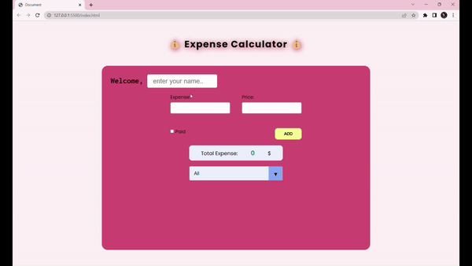

# Expense-Calculator

<h3>Used programs and libraries:</h3>

 - HTML

 - CSS

 - JavaScript

 - Google fonts

This application is created in such a way that the user can add their spending, check the payment status and delete the spending.
It also shows the user's total spending.

<h3>Screen View</h3>

